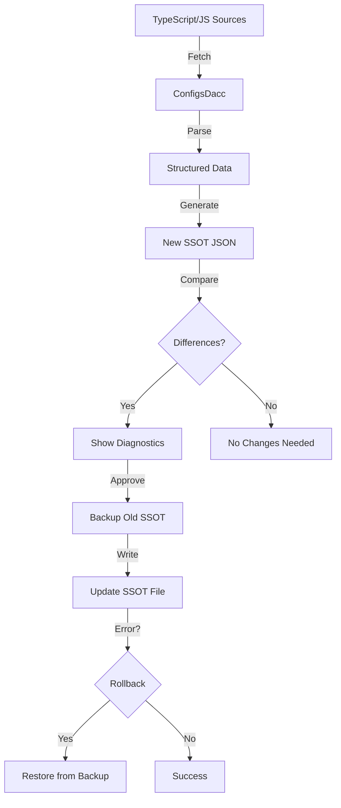

# Developer Utils (`_dev_utils`)

This directory contains development utilities for maintaining and synchronizing the Cosmograph Python package with its TypeScript/JavaScript sources.

## Table of Contents

- [Refresh SSOT Script](#refresh-ssot-script)
- [Module Organization](#module-organization)
- [Workflow Overview](#workflow-overview)

---

## Refresh SSOT Script

The `refresh_ssot.py` script is the primary tool for keeping the Python interface synchronized with upstream TypeScript/JavaScript sources.

### What is SSOT?

**SSOT** (Single Source of Truth) is a JSON file (`params_ssot.json`) that defines all Cosmograph configuration parameters, including:
- Parameter names
- Type annotations
- Default values
- Descriptions

This SSOT drives the Python API's function signatures, type hints, and documentation.

### Quick Start

**⚠️ Before You Begin**: Ensure that the source URLs in `_resources.py` are up to date. If you encounter 404 errors, see [Troubleshooting](#troubleshooting) below.

#### 1. Diagnose (Check for Changes)

See what would change without modifying any files:

```bash
python -m cosmograph._dev_utils.refresh_ssot diagnose
```

This will:
- Fetch fresh sources from GitHub
- Generate a new SSOT
- Compare with current SSOT
- Display diagnostic information
- Make **no changes** to any files

#### 2. Refresh (Update SSOT)

Update the SSOT with fresh data from remote sources:

```bash
# Interactive mode (asks for confirmation)
python -m cosmograph._dev_utils.refresh_ssot refresh

# Automatic mode (no prompts, useful for CI/CD)
python -m cosmograph._dev_utils.refresh_ssot refresh --auto

# Dry run (see what would happen)
python -m cosmograph._dev_utils.refresh_ssot refresh --dry-run
```

**Safety Features:**
- Automatically creates backups before making changes
- Attempts to restore from backup if errors occur
- Requires confirmation unless `--auto` is specified

#### 3. Cleanup Old Backups

```bash
# Keep only the 3 most recent backups
python -m cosmograph._dev_utils.refresh_ssot cleanup-backups

# Keep 5 most recent backups
python -m cosmograph._dev_utils.refresh_ssot cleanup-backups --keep-backups 5
```

#### 4. Show Information

Display information about the current SSOT and configuration:

```bash
python -m cosmograph._dev_utils.refresh_ssot info
```

### Command Reference

#### `diagnose`

Diagnose differences between current and fresh SSOT.

**Options:**
- `--show-full`: Show full diagnostic details including SSOT preview

**Example:**
```bash
python -m cosmograph._dev_utils.refresh_ssot diagnose --show-full
```

#### `refresh`

Refresh the SSOT from remote sources.

**Options:**
- `--auto`: Automatically proceed without confirmation prompts
- `--skip-backup`: Skip creating backup files (not recommended)
- `--dry-run`: Show what would be done without actually doing it

**Examples:**
```bash
# Interactive mode
python -m cosmograph._dev_utils.refresh_ssot refresh

# Automatic mode for CI/CD
python -m cosmograph._dev_utils.refresh_ssot refresh --auto

# Dry run to preview changes
python -m cosmograph._dev_utils.refresh_ssot refresh --dry-run
```

#### `cleanup-backups`

Clean up old backup files.

**Options:**
- `--keep-backups N`: Number of recent backups to keep (default: 3)

**Example:**
```bash
python -m cosmograph._dev_utils.refresh_ssot cleanup-backups --keep-backups 5
```

#### `info`

Display information about the current SSOT and configuration.

**Example:**
```bash
python -m cosmograph._dev_utils.refresh_ssot info
```

### Workflow Recommendations

1. **Regular Updates**: Run `diagnose` periodically to check for upstream changes
2. **Before Major Releases**: Run `refresh` to ensure alignment with latest JS sources
3. **After Errors**: Check backup files if something goes wrong
4. **Version Control**: Commit the updated `params_ssot.json` to track changes over time

### Troubleshooting

**Problem**: Refresh fails with an error

**Solution**: The script automatically attempts to restore from backup. If that fails, manually restore from the backup file:
```bash
cp cosmograph/data/_old_params_ssot.json cosmograph/data/params_ssot.json
```

**Problem**: 404 errors when fetching sources

**Solution**: The source URLs in `_resources.py` may be outdated. Check if:
1. The remote repository structure has changed
2. Files have been moved or renamed
3. Branches have been renamed or deleted

Update the `source_urls` dictionary in `_resources.py`:
```python
source_urls = {
    "cosmos/variables.ts": "https://github.com/cosmograph-org/cosmos/blob/main/src/variables.ts",
    # Update other URLs as needed
}
```

**Problem**: Diagnostics show unexpected differences

**Solution**: 
1. Review the diagnostic output carefully
2. Check if upstream TypeScript sources have changed significantly
3. Consider running with `--show-full` for more details
4. Consult the team before proceeding with refresh

**Problem**: Need to update from a specific branch or commit

**Solution**: Edit the `source_urls` dictionary in `_resources.py` to point to specific branches or commits.

---

## Module Organization

The `_dev_utils` directory contains several specialized modules:

### `_resources.py` - Configuration Resource Management

**Purpose**: Core module for fetching, parsing, and managing configuration data from TypeScript/JavaScript sources.

**Key Classes:**

- **`ConfigsDacc`**: Main class for SSOT management
  - Fetches sources from GitHub
  - Parses TypeScript and markdown files
  - Generates Python signatures and docstrings
  - Provides diagnostic tools for alignment checking
  
- **`ResourcesDacc`**: Manages non-configuration resources (color tables, etc.)

**Key Features:**
- Caching mechanism (JSON and Parquet files)
- Source URL configuration
- Parsing of TS interfaces and markdown documentation
- Alignment verification between sources

**Example Usage:**
```python
from cosmograph._dev_utils._resources import ConfigsDacc

# Create staging instance
stage = ConfigsDacc(config_files_dir="/path/to/staging")

# Fetch and parse sources
_ = stage.source_strings

# Generate new SSOT
new_ssot = stage.cosmograph_base_params_json()

# Compare with current
from cosmograph._dev_utils._resources import configs_dacc
diffs = configs_dacc.signature_diffs(stage)
```

### `_code_sync.py` - Code Synchronization

**Purpose**: Tools for injecting SSOT data into Python code, including signature manipulation and code generation.

**Key Functions:**

- **`order_cosmo_params(sig)`**: Reorders parameters in a specific logical order
- **`param_spec_code_lines(sig)`**: Generates parameter specification code
- **`code_str_with_signature(func, sig)`**: Creates new function with modified signature
- **`replace_function_definition_in_module(...)`**: Updates function definitions in module files
- **`diagnose_parameter_default(param)`**: Checks alignment between defaults and type annotations

**Example Usage:**
```python
from cosmograph._dev_utils._code_sync import order_cosmo_params
from i2 import Sig

# Reorder parameters logically
old_sig = Sig(some_function)
new_sig = order_cosmo_params(old_sig)
```

### `_color_util.py` - Color Utilities

**Purpose**: Utilities for handling color specifications in various formats.

**Key Functions:**

- **`is_hex_color_str(x)`**: Check if value is a hex color string
- **`is_rgb_color_tuple(x)`**: Check if value is an RGB tuple
- **`is_html_color_name(x)`**: Check if value is an HTML color name
- **`is_valid_color(x)`**: Check if value is any valid color specification
- **`resolve_colors(...)`**: Comprehensive function for resolving various color specifications
- **`get_matplotlib_palette(palette)`**: Get color palette from Matplotlib

**Example Usage:**
```python
from cosmograph._dev_utils._color_util import resolve_colors
import pandas as pd

data = pd.DataFrame({'x': [1, 2, 3], 'value': [0.1, 0.5, 0.9]})
colors = resolve_colors(data, color=data['value'], palette='viridis')
```

### `_traitlets_util.py` - Traitlets Utilities

**Purpose**: Convert between traitlets types and Python type annotations.

**Key Functions:**

- **`trait_to_py(trait)`**: Convert traitlets trait to Python type
- **`extract_type_params(trait_type, trait)`**: Extract type parameters from traits

**Mapping**: Provides `py_type_for_traitlet_type` dictionary mapping traitlets types to Python types.

**Example Usage:**
```python
from cosmograph._dev_utils._traitlets_util import trait_to_py
import traitlets

trait = traitlets.Union([traitlets.Unicode(), traitlets.Float()])
py_type = trait_to_py(trait)  # typing.Union[str, float]
```

### `refresh_ssot.py` - SSOT Refresh Script

See [Refresh SSOT Script](#refresh-ssot-script) section above.

### `scrap.py` - Experimental Code

**Purpose**: Temporary or experimental code that hasn't been formalized yet.

**Note**: Contents are subject to change or removal. Not part of the stable API.

---

## Workflow Overview

### High-Level Process



### Data Flow

1. **Source Fetching** (`_resources.py`)
   - Fetches TypeScript and markdown files from GitHub
   - Caches locally for offline work
   - Configurable source URLs

2. **Parsing** (`_resources.py`)
   - TypeScript interfaces → Type information
   - TypeScript variables → Default values
   - Markdown documentation → Descriptions

3. **Unification** (`_resources.py`)
   - Merges data from multiple sources
   - Resolves conflicts (e.g., CosmographConfig takes precedence)
   - Validates alignment with traitlets

4. **Generation** (`_resources.py`, `_code_sync.py`)
   - Creates unified SSOT JSON
   - Generates Python signatures
   - Produces docstrings

5. **Injection** (`_code_sync.py`)
   - Updates function signatures
   - Modifies module code
   - Maintains docstrings

### File Structure

```
_dev_utils/
├── DEV_UTILS_README.md       # This file
├── __init__.py                # Module initialization
├── _resources.py              # Configuration resource management
├── _code_sync.py              # Code synchronization tools
├── _color_util.py             # Color utilities
├── _traitlets_util.py         # Traitlets conversion utilities
├── refresh_ssot.py            # CLI for SSOT refresh
├── scrap.py                   # Experimental code
└── data/                      # Cached and generated data
    ├── color_names.json       # HTML color names
    ├── params_ssot.json       # SSOT (in parent data/ dir)
    └── config_prep/           # Intermediate parsed data
        ├── parsed_defaults.json
        ├── parsed_types.json
        ├── parsed_descriptions.json
        └── source_strings.json
```

---

## Development Notes

### Adding New Sources

To add a new TypeScript/JavaScript source:

1. Edit `source_urls` in `_resources.py`:
   ```python
   source_urls = {
       "new_source/file.ts": "https://github.com/.../file.ts",
       # ... existing sources
   }
   ```

2. Update `source_url_groups` if needed:
   ```python
   source_url_groups = {
       "types": [..., "new_source/file.ts"],
   }
   ```

3. Run `diagnose` to see the impact:
   ```bash
   python -m cosmograph._dev_utils.refresh_ssot diagnose
   ```

### Customizing Behavior

Edit `ConfigsDacc` class properties in `_resources.py`:

```python
class ConfigsDacc:
    exclude_params_in_sig = ("_ipc_points", "_ipc_links")
    rm_default_if_nan_in_sig = False
    set_default_to_none_if_nan = True
    # ... other options
```

### Testing Changes

Before committing SSOT changes:

1. Run diagnostics to understand changes
2. Test with a subset of parameters if possible
3. Verify that generated signatures are valid Python
4. Check that docstrings render correctly
5. Run unit tests if available

---

## Best Practices

1. **Always backup**: Don't use `--skip-backup` unless you're certain
2. **Review diagnostics**: Understand what's changing before proceeding
3. **Version control**: Commit SSOT changes with descriptive messages
4. **Document changes**: If upstream sources change significantly, document why
5. **Test thoroughly**: After SSOT updates, test the affected interfaces
6. **Clean up regularly**: Remove old backups to avoid clutter

---

## Support

For issues or questions:
- Check the [main repository discussions](https://github.com/cosmograph-org/py_cosmograph/discussions)
- Review existing issues
- Contact the development team

---

*Last updated: 2025-01-30*
